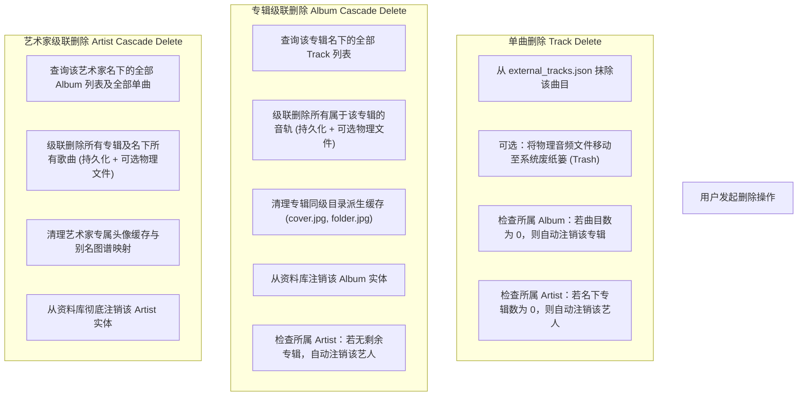

# 端到端声纹识别、元数据解析管线与实体生命周期架构方案
# (Acoustic Metadata Pipeline & Entity Lifecycle Architecture)

> **版本**：1.0 · 2026-09-20  
> **定位**：MSRU 核心音乐实体识别、元数据管线、多级存储与生命周期级联清理的持久性权威技术规范。  
> **对齐标杆**：MusicBrainz Picard (Scan/Cluster 双轨) + beets (加权打分与命名模板) + Roon (实体图谱、多版本与三层元数据覆盖)。  
> **配合文档**：[交互设计图册](../Blueprint/InteractionAtlas.md) 9.2、11.2、12 节。

---

## 1. 方案愿景与工业级 9 步闭环管线

在现代专业数字音频管理中，**文件不等于歌曲，文件名更不可信**。用户导入的文件可能是 `音乐 (37).flac`、`track01.wav` 或命名残缺的录音。系统的核心使命是：**以声音本身作为第一物理身份证，通过确定性算法与多维证据链，还原其在人类音乐知识图谱中的真实坐标，并提供全生命周期的自洽管理**。

### 1.1 端到端 9 步标准管线流图

```text
用户拖入音频 / 文件夹 (支持乱码名，如 unknown.flac)
  │
  ▼ ① 技术规格与内嵌信息探测 (AVFoundation / FFmpeg)
  │   提取：duration, sampleRate, bitDepth, channels, bitrate, existingRawTags
  │
  ▼ ② Chromaprint 提取声学特征 (Acoustic Fingerprint)
  │   计算 PCM 频谱特征向量，生成 Base64 指纹 (duration + fingerprint)
  │
  ▼ ③ AcoustID 官方云端查询 (AcoustID Lookup)
  │   通过 clientKey (eKeKSuffE6) 换取确定性 MusicBrainz Recording MBID 与相似度 score
  │
  ▼ ④ MusicBrainz 实体知识图谱展开 (MusicBrainz Entity Graph)
  │   以 Recording MBID 为锚，展开 Artist, Work, ISRC, Credits 及候选 Releases[] 列表
  │
  ▼ ⑤ Cover Art Archive 高清封面获取 (Release Artwork)
  │   根据 Release MBID 拉取 1200px / 500px 原生唱片封面
  │
  ▼ ⑥ Release Resolver 8 维加权消歧打分 (Exact Release Scoring)
  │   消歧算法：区分原版、精选集、周年纪念版、数字重制版，计算置信度并分流
  │
  ▼ ⑦ 集中预审与用户决策 (Import Review Dashboard)
  │   High (>=0.95) 自动选定；Medium (0.60~0.94) 展现多版本单选卡片供用户抉择
  │
  ▼ ⑧ 物理文件双写回 (AudioTagWriter & Cover Export)
  │   将标准 ID3v2.4 / Vorbis 标签与封面写入音频文件本身，同时输出同级 cover.jpg
  │
  ▼ ⑨ 规范目录整理与本地资料库落盘 (SafeFileOrganizer & LocalLibraryCommit)
      按照 "Artist/Year - Album/Track - Title.ext" 安全移动入库，建立实体图谱关联
```

---

## 2. 核心机制：Scan（单曲声纹）与 Cluster（专辑聚类）双轨制

工业级管线最致命的误区是“将所有文件拆散逐一识别”，或“完全依赖文件名与内嵌标签”。MSRU 采用与 Picard 完全一致的 **双轨输入分流架构**：

```text
                     ┌── 单曲 / 孤立文件 ──▶ 【Scan 声纹轨】
                     │                         不信文件名，Chromaprint 盲测
用户拖入输入集合 ────┤
                     │                         按目录结构、曲目数、曲序连续性
                     └── 批量文件 / 文件夹 ──▶ 【Cluster 聚类轨】
                                               聚合为候选专辑，整专整轨匹配 (99.9%)
```

### 2.1 Scan（纯声纹盲测轨）
* **适用场景**：用户拖入单首散落歌曲、乱码文件名（如 `track01.wav`）、无任何内嵌 ID3 标签的文件。
* **执行策略**：
  1. 彻底忽略文件名与目录名；
  2. 提取 Chromaprint 声学指纹与精确时长；
  3. 优先检索本地声纹记忆库（`LocalFingerprintRegistry`），命中即 0ms 返回；
  4. 未命中则调用 AcoustID Web API 获取 Recording MBID；
  5. 拿 Recording 查询 MusicBrainz 获取该曲目的官方正规信息。

### 2.2 Cluster（专辑聚类整轨轨）
* **适用场景**：用户拖入包含整张专辑或多个音轨的文件夹。
* **执行策略**：
  1. **Picard 聚类算法**：先按物理父目录、音轨序号连续性、时长分布聚类为 `AlbumCluster`；
  2. **整轨协同校验**：不逐一去猜专辑，而是将整组音轨的 Recording 集合向 MusicBrainz 发起整专匹配；
  3. **准确率飞跃**：当 10 首曲目全部命中同一张 Release 时，整专置信度直接锁定为 99.9%，杜绝单曲被误归入不同的拼盘精选集。

---

## 3. 实体消歧：Recording（录音事实）与 Release（发行版本）解耦

### 3.1 核心技术矛盾
声纹（AcoustID）只能证明**“这段音频波形来自哪一次录音事件（Recording）”**，但**永远无法仅凭声纹证明“这个文件来自哪一个具体发行版本（Release）”**。
* 例如：周杰伦《晴天》的同一次录音，同时存在于：
  1. 2003 台湾首发 CD 版
  2. 2003 亚太数字引进版
  3. 2007 周杰伦精选集
  4. 2023 20周年黑胶复刻版
* 它们的音频采样数据几乎完全相同，AcoustID 对它们返回完全相同的 Recording MBID。

### 3.2 8 维加权打分模型 (Exact Release Resolver)

为了从多个候选 Release 中精准挑选出用户手中的那一张，系统在拿到 Recording 后执行第二阶段加权评分：

$$\text{ConfidenceScore} = \sum_{i=1}^{8} w_i \times S_i$$

| 维度 | 权重 $w_i$ | 考量特征 | 说明 |
|---|---|---|---|
| **AcoustID 基础分** | **40%** | 声纹匹配吻合度 | AcoustID 官方打分（通常 0.90 ~ 1.00） |
| **专辑名称匹配度** | **15%** | 原始专辑标签 / 候选专辑名 | 字符串相似度（Levenshtein + Token Jaccard） |
| **曲目标题匹配度** | **10%** | 原始曲名 / 规范曲名 | 排除规格后缀后的文本相似度 |
| **艺术家名称匹配度** | **10%** | 原始歌手 / 规范歌手 | 匹配官方名称与多语言别名库 |
| **曲目序号与总曲数** | **10%** | Track Position / Total Tracks | 该 Release 的总曲数与曲序是否与文件完全契合 |
| **音频时长吻合度** | **5%** | 物理音频时长 vs 发行版标称时长 | 误差 $\le 2\text{s}$ 得满分，误差 $>5\text{s}$ 递减 |
| **发行年份/年代** | **5%** | 文件创建时间 / 目录中包含的年份 | 年份一致性考量 |
| **目录与文件上下文** | **5%** | 父文件夹名称线索 | 文件夹是否包含 Release 关键词（如 Deluxe / Remaster） |

### 3.3 置信度三级漏斗决策矩阵

```text
                      ConfidenceScore 判定
                               │
         ┌─────────────────────┼─────────────────────┐
         ▼                     ▼                     ▼
 High (>= 0.95)       Medium (0.60 ~ 0.94)        Low (< 0.60)
  【自动选定】              【人工复核】             【安全保持】
自动应用得分最高的     在预审面板列出 Top 3 候选    不强行修改文件，
Release，准备入库      版本卡片，由用户一键选定    保留原始标签原样入库
```

---

## 4. 全链路存储、本地持久化与三层元数据管理

为了彻底打破专有播放器的“数据围墙”，MSRU 确立 **“物理音频文件标准标签 + 本地 SQLite/JSON 知识图谱” 双落盘** 原则。

```text
┌────────────────────────────────────────────────────────────────────────┐
│ 物理存储层 (Physical File System)                                      │
│ • 音频文件本身：写入 ID3v2.4 / Vorbis Comment / MP4 ilst 标准标签      │
│ • 唱片封面文件：同级目录输出 cover.jpg (1200px / 500px 高保真)         │
├────────────────────────────────────────────────────────────────────────┤
│ 本地记忆与图谱层 (Local Persistent Repositories)                      │
│ • 声纹记忆库 (LocalFingerprintRegistry)：fingerprint_registry.json     │
│ • 路径规则库 (PathHeuristicRuleStore)：path_heuristic_rules.json       │
│ • 音乐资料库与实体图谱 (LocalLibraryRepository)：external_tracks.json   │
├────────────────────────────────────────────────────────────────────────┤
│ 运行时三层覆盖解析层 (Runtime Tiered Metadata Overlay)                 │
│ 1. User Metadata     (最高优先级：用户自定义覆盖、强制评分)            │
│ 2. Canonical Metadata(中间优先级：MusicBrainz / AcoustID 权威图谱)     │
│ 3. Original Metadata (保底优先级：文件物理读取到的原始只读标签)        │
└────────────────────────────────────────────────────────────────────────┘
```

### 4.1 物理文件双写回 (TagWriter)
用户在预审面板点击「确认并安全入库」时，系统调用 `AudioTagWriter` 将标准元数据写回文件：
* **核心标签字典**：
  * `TITLE`, `ARTIST`, `ALBUM`, `ALBUMARTIST`
  * `TRACKNUMBER`, `TOTALTRACKS`, `DISCNUMBER`, `TOTALDISCS`
  * `DATE` / `YEAR`, `GENRE`, `ISRC`
  * `MUSICBRAINZ_TRACKID` (Recording MBID)
  * `MUSICBRAINZ_ALBUMID` (Release MBID)
  * `MUSICBRAINZ_ARTISTID` (Artist MBID)
  * `ACOUSTID_FINGERPRINT` (可选)
* **封面双落盘**：
  * 将图片二进制写入音频文件内嵌封面块（ID3 APIC / FLAC PICTURE）；
  * 在音频同级目录输出标准的 `cover.jpg`，供第三方播放器与 Finder 快速缩略。

### 4.2 本地声纹记忆持久化 (LocalFingerprintRegistry)
* **零延迟秒开**：首次在线识别成功后，立即将 `(fingerprint, duration) -> (title, artist, album, releaseMBID, recordingMBID, artworkData)` 写入持久化存储。
* **重复导入保障**：当下一次拖入相同歌曲（即使换了乱码文件名），本地声纹库 0ms 闪电拦截，置信度 100% 自动锁定权威元数据。

---

## 5. 实体生命周期与级联清理策略 (Cascade Deletion & Cleanup)

实体之间存在严密的图谱拓扑关系：`Artist` $\to$ `Album` $\to$ `Track` $\to$ `PhysicalFile`。当用户执行删除操作时，系统严格执行**级联清理协议**，杜绝孤儿数据与磁盘脏文件。



### 5.1 级联删除的安全原则
1. **二次确认保护**：在删除专辑或艺术家时，必须弹出破坏性 `.confirmationDialog`，明确向用户报出级联影响的精确数字：
   > “确认删除艺术家‘周杰伦’？此操作为级联删除，将同时从资料库中清除其名下的 14 张专辑与 142 首歌曲。”
2. **物理文件安全防灾**：默认物理文件清理采用 macOS 原生 `FileManager.default.trashItem(at:resultingItemURL:)` 移动至**系统废纸篓**，严禁使用底层硬销毁（`removeItem`），保证用户误操作时拥有 100% 找回能力。
3. **元数据与声纹垃圾回收 (Garbage Collection)**：
   * 当曲目被删除后，其对应的声纹特征在 `LocalFingerprintRegistry` 中保留为记忆标记（以防下次再次误导用户为未识别）；
   * 在「元数据中心」提供「清理未引用声纹缓存」与「重置路径学习规则」的手动维护入口。

---

## 6. 界面与交互设计规范（纯文本线框图）

按照 `Docs/Blueprint/InteractionAtlas.md` 规范，本管线在客户端划分为 4 大交互板块。

### 板块 1：拖入与导入 Staging 悬浮工作区
用户直接将文件或文件夹拖入窗口任何区域，触发即时进度 HUD：

```text
┌─ 正在识别音乐资产 (Acoustic Pipeline HUD) ───────────────────────────────┐
│ 正在计算 Chromaprint 声学指纹并连接 AcoustID...                          │
│ ━━━━━━━━━━━━━━━━━━━━━━━━━━━━━━━━━━●━━━━━━━━━━━━  68% (12/18 首)           │
│                                                                          │
│ 当前曲目: unknown_track_04.wav                                           │
│ 规格采样: FLAC · 24-bit / 48kHz · 2ch · 1,536 kbps · 4:18               │
│ 声纹状态: 已提取 (AQADtM...) · 正在向 MusicBrainz 检索发行版本...        │
│                                                                          │
│                                                  [后台运行] [取消导入]   │
└──────────────────────────────────────────────────────────────────────────┘
```

### 板块 2：置信度审核与版本消歧工作区 (Import Review Dashboard)
导入完成后自动展开集中预审工作区，提供多版本消歧、Dry-Run 目录变更树与撤销横幅：

```text
┌─ 导入与元数据预审工作区 (Import Review Workspace) ──────────────────────────────────────────────────┐
│ 扫描共 12 首 · 自动匹配 10 首 (高置信度 98%) · 待消歧候选 2 首                                       │
├─────────────────────────────────────────────────────────────────────────────────────────────────────┤
│ [全部待确认 ▾] [按专辑聚类 ▾]                                                        [搜索待审曲目…] │
├─────────────────────────────────────────────────────────────────────────────────────────────────────┤
│ 候选专辑 / 音轨             声纹置信度   MusicBrainz 匹配候选与版本决策                        操作 │
│ ▾ 01-10 [叶惠美] (整专聚类) █████████░ 96%  Release: 2003 Taiwan CD (10/10 Tracks 吻合)      [✓ 已选定] │
│   ├── 01 以父之名.flac      █████████░ 99%  Recording: 以父之名 · 5:42 · Track 01            [✓]        │
│   ├── 03 晴天.flac          █████████░ 98%  Recording: 晴天 · 4:29 · Track 03                [✓]        │
│   └── 07 梯田.flac (发现多版本)                                                                         │
│       ├── ◉ [首选] 2003 Taiwan CD 原版 (置信度 96%) ─────────────────────────────── [采用此版本]       │
│       ├── ○ [备选] 2007 经典精选重制版 (置信度 82%)                                                     │
│       └── ○ [备选] 2023 20周年黑胶纪念版 (置信度 78%)                                                   │
├─────────────────────────────────────────────────────────────────────────────────────────────────────┤
│ 规范目录整理预检计划 (Dry-Run Preview):                                                             │
│ • 周杰伦/2003 - 叶惠美/01 - 以父之名.flac (重命名自 unknown_01.flac)                                │
│ • 周杰伦/2003 - 叶惠美/03 - 晴天.flac (重命名自 track03.wav)                                        │
│ • 派生封面: 周杰伦/2003 - 叶惠美/cover.jpg (Cover Art Archive 1200px)                               │
├─────────────────────────────────────────────────────────────────────────────────────────────────────┤
│ [放弃未确认项]           [写入物理Tag并安全入库 (12)]   [以原始文件直接导入]                                │
└─────────────────────────────────────────────────────────────────────────────────────────────────────┘
```

### 板块 3：曲目属性检查器多版本与三层覆盖面板 (Track Inspector)
选中资料库曲目时，右侧抽屉展示三层覆盖控制面板，支持字段级回退：

```text
┌─ 曲目属性：晴天 ───────────────────────────────────┐
│ [曲目详情] [版本列表 (3)] [元数据覆盖层]            │
├──────────────────────────────────────────────────┤
│ 权威身份与声纹：                                  │
│ • Recording MBID: 3a98ef12-00b4-4861-9c8f...     │
│ • 声纹记忆状态: [● 本地已激活] (二次匹配 100%)    │
│ • 发行版本: 叶惠美 (2003 台湾首发 CD 版)          │
├──────────────────────────────────────────────────┤
│ 三层元数据字段级覆盖切换：                        │
│ • 标题：[权威 Canonical ▾] (晴天)                │
│ • 歌手：[多语言 Alias ▾]   (周杰伦 / Jay Chou)   │
│ • 专辑：[权威 Canonical ▾] (叶惠美)              │
│ • 标签：[原始 Original  ▾] (保留文件初始标签)    │
│                                                  │
│ [将当前信息写回物理文件]     [回退至文件初始原始标签]│
└──────────────────────────────────────────────────┘
```

### 板块 4：元数据中心与提供商管理 (Metadata Manager)
管理声纹库、路径规则学习、公网识别与元数据提供商配置：

```text
┌─ 元数据中心 (Metadata Management Center) ────────────────────────────────────────────────────────┐
│ [导入与预审] [✓ 元数据提供商] [声纹记忆库 (1,248)] [目录学习规则 (16)] [MusicBrainz 在线状态]    │
├──────────────────────────────────────────────────────────────────────────────────────────────────┤
│ 元数据提供商配置与优先级策略                                                                     │
│                                                                                                  │
│ ≡ [第 1 优先级]   Apple Music (MusicKit)                   [启用/停用 ●]                        │
│   官方 Apple 音乐目录，包含高质量官方专辑大图与权威艺术家信息。                                 │
│                                                                                                  │
│ ≡ [第 2 优先级]  🖼 Cover Art Archive (官方无损封面)          [启用/停用 ●]                        │
│   MetaBrainz 官方全球唱片超清封面图库 (1200px/500px)。                                           │
│                                                                                                  │
│ ≡ [第 3 优先级]  🌐 MusicBrainz & AcoustID 权威维基          [启用/停用 ●]                        │
│   开源全球录音数据库与声纹识别网络。                                                             │
│   AcoustID API Key: [ eKeKSuffE6                  ] [验证连接]  状态: ● 已连接                   │
│                                                                                                  │
│ ≡ [第 4 优先级]  🏷 本地内嵌音频标签 (ID3/Vorbis/APIC)       [启用/停用 ●]                        │
│   从物理音频文件自带的内嵌标签中读取保底信息。                                                   │
└──────────────────────────────────────────────────────────────────────────────────────────────────┘
```

---

## 7. 架构与边界守则

1. **零架构污染原则**：底层音频技术提取、声纹计算与标签写入严格封装在 `Music/Library` 或 `AppFoundation` 中，禁止反向依赖任何 UI 框架（`SwiftUI`, `AppKit`, `UIKit`）。
2. **防爆并发边界**：对外部 MusicBrainz API 调用施加 `1.0s/request` 强制节流阀；对 AcoustID 查询施加并发队列限制，防止触发 IP 封禁或 429 异常。
3. **事务原子性**：文件移动与 Tag 写入必须保留 Undo 事务日志；若其中 1 步失败，自动回滚上一步并向用户汇报精准错误。
