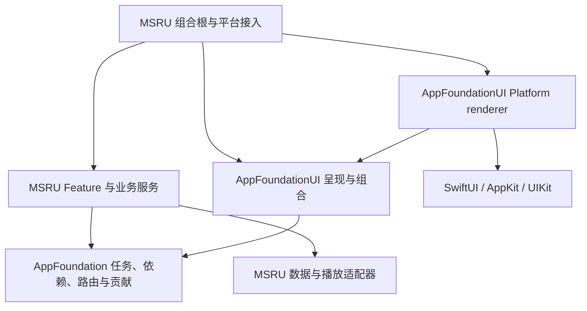
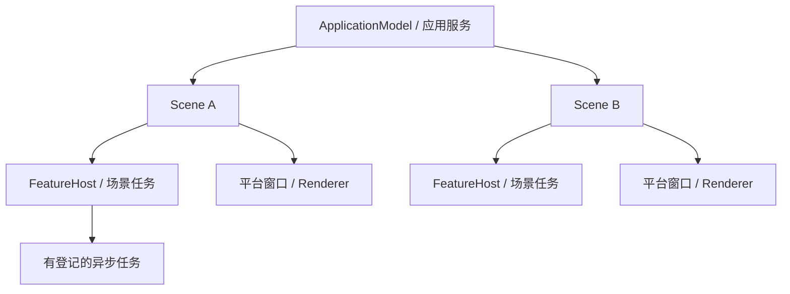

# MSRU / AppFoundation：目标架构

审计基线：2026-09-20，`facf01c` 加当前未提交工作树。本报告重点核查组合、Shell、FeatureHost、场景恢复和数据边界，抽查测试与近期 Git 演进；不是全仓库、全部历史或全部平台的穷尽审计。其余专题见同目录及 `Docs/UI`、`Docs/Roadmap`。

## 核心判断

停止向上寻找一个包办所有事情的 Runtime。目标是少量有明确所有者的运行对象，加一个无生命周期的呈现组合器。框架应帮助产品管理重复机制，但业务含义、平台选择和资源寿命必须由产品明确表达。“产品只写 WHAT”是方向，不是可以取消集成工作的承诺。

先服务好 MSRU；Finder、PMS、ERP、IDE 目前只能用于反例检验，不能算已经验证过的消费者。未来五年的稳定性来自边界和可删除性，不来自今天设计完全部 API。

## 概念及其所有者

| 概念 | 定义与落点 |
|---|---|
| Application | 一次进程运行及共享业务资源。当前 `ApplicationModel` 是产品组合根；播放、曲库、账号可共享。不是所有可观察状态的大容器。 |
| Scene | 一个独立交互会话。拥有导航、选择、面板状态和 FeatureHost。Window 是平台承载，不等同于会话身份或持久化记录。 |
| Feature | 一项业务能力及其状态转换；静态定义不是存活实例。简单页面无需强行 Feature 化。 |
| Runtime | 拥有状态、任务或外部资源，并负责停止它们的对象。不是每层都必须有一个此后缀。 |
| Workspace | 当前工作区域的内容、上下文和操作。现有 `WorkspacePresentation` 描述这个区域；不要据此推导 IDE 项目、文档集合或数据库工作区模型。 |
| Shell | 承载导航、工作区、辅助面板和持久控件的界面结构。每个 Scene 各有呈现，底层资源可以共享。 |
| Presentation | 可构造内容及操作的 UI 描述，留在 AppFoundationUI。含 `AnyView` 的 resolved 值不是跨线程 DTO，也不是恢复快照。 |
| Renderer | 将描述映射到原生平台组件，维护控件与用户交互的同步；不决定业务加载或快照内容。 |
| Dependency | 构造时交付的能力或资源引用；容器负责传递，不负责决定资源寿命。 |
| Service | 完成具体业务操作的对象/值。当前 `FeatureService` 实际是状态转换处理器，不要求再套领域 Service。 |
| Provider | 同一领域能力的不同来源/后端，如 CatalogProvider、PlaybackProvider；不是所有服务的共同父协议。 |
| Localization | 国际化基础能力下沉框架层，具体文案与语言由应用层定义。框架层（AppFoundation）提供 `LanguageSettings`、`SupportedLanguage`、包资源与动态 `Locale` 解析；应用层（MSRU）定义 String Catalog（`.xcstrings`）、支持语言（英语、汉语、藏语）及设置联动，支持系统默认跟随与用户偏好自选。 |

## 模块与依赖方向

箭头表示“依赖”。这些是逻辑边界，先保留现有两个 package target，不急着拆成更多模块。



Core 不依赖 UI、MSRU 或任何音乐 SDK。UI 的呈现区域不依赖 AppKit/UIKit；这些依赖集中到 Platform。MSRU 的平台组合根可以接触原生类型，业务 View 不创建窗口或 split controller。产品上下文应逐步收窄到所需能力，避免所有目的地无限制访问整个 `SceneModel`。

## 生命周期与状态流



共享播放的寿命属于应用；播放器的窗口呈现属于场景。关闭 A 不停止 B 或应用级播放。离开 Browse 是否取消搜索由 Feature 的明确策略决定，不能等同于 SwiftUI 某次 `onDisappear`。恢复记录可跨进程存在，不是运行对象的子对象。

```text
用户输入 / 外部 URL
  → 选择目标 Scene → Feature Action / 场景命令
  → 业务状态变化 → 呈现组合 → 平台策略 → Renderer
  → 原生交互回写同一份场景状态
```

## Application Runtime 的终点

`ApplicationShellResolver.resolve` 当前只有 workspace 查询、context/accessory 映射和 toolbar 合并，没有任务、资源或状态寿命。已由原无状态的 `ApplicationShellRuntime` 规范更名为 `ApplicationShellResolver`，不设冗余别名；不扩展成 `ApplicationRuntime`。

应用组合根负责装配服务、启动/停止、场景注册和外部命令分发；场景负责导航、FeatureHost、恢复与面板状态；ShellResolver 只组合呈现。Search/Selection 属于对应 Feature；Focus 由平台维护，必要时暴露类型化操作；没有证据需要通用 SearchRuntime、SelectionRuntime、FocusRuntime。

当前 `ApplicationCommand` 主要是导航/窗口命令。不要直接把它扩成承载所有业务 action 的全局总线。工具栏与菜单需要共享动作时，先共享具体操作及其可用条件，目标场景取自焦点场景。应用、工作区项目的重复 ID 在组合时拒绝，不能悄悄覆盖。

## 多语言与国际化架构 (Localization Architecture)

遵循“框架层提供基础设施，应用层定义具体文案与语言”的原则，严格采用 Apple 原生最佳实践（Xcode String Catalogs `.xcstrings`）：

1. **框架层（AppFoundation / AppFoundationUI）**：
   - `SupportedLanguage` 枚举：统一管理系统默认（`.system`）、英语（`.english`）、简体中文（`.chinese`）与藏语（`.tibetan`），具备动态 `locale` 推导。
   - `LanguageSettings` 服务：应用级 `@Observable` 响应式对象，持久化用户选定语言至 `UserDefaults`，计算并向外提供 `resolvedLocale: Locale?`（为 `nil` 时无缝继承宿主 macOS/iOS 系统语言）。
   - SPM 资源包支持：Package 声明 `defaultLocalization: "en"` 与 `.process("Resources")`，框架 UI 基础组件文案独立于应用。

2. **应用层（MSRU）**：
   - 集中式 String Catalog：根目录 `Localizable.xcstrings` 作为权威多语言目录，代码中采用开发语言英文直接调用（如 `Text("Listen Now")` 或 `String(localized: "Radio")`），编译器与运行时自动建立映射。
   - 动态环境注入：`SwiftUISceneRootView`（iOS/visionOS）与 `MSRUMacWindowComposition`（macOS）顶层侦听 `languageSettings.resolvedLocale`，注入 `.applyLocaleOverride()` 驱动界面与导航栏全局即时响应切换。
   - 用户偏好自选：在“设置 - 通用 - 语言”提供可视化分段选择器，设置变动即刻生效，无需重启应用。

## 平台几何与呈现意图边界 (Platform Geometry & Presentation Invariants)

```text
Platform owns geometry.
Product composition selects policy.
Feature owns presentation intent.
```

- **Native Platform Layer (AppFoundationUI)**: 负责发现并暴露实际的 Window、Split 与 Safe-Area 真实几何（通过 `WorkspaceSafeAreaContainer` 向 SwiftUI 注入 `\.workspaceSafeAreaInsets` 环境值）。macOS Split region 的几何策略属于 composition-time policy，在 `NSSplitViewItem` 加入 split hierarchy 前完成配置，不依赖运行期修改结构性 layout policy 来重建 underlap geometry。
- **Product Composition (MSRU / Composition)**: 负责决定工作区是否启用原生沉浸式 Underlap 模式。
- **Feature UI (MSRU / Features)**: 负责决定具体业务内容哪些避让、哪些穿越未遮挡工作区边界。
- **不变量约束**：任何 Feature 严禁硬编码 Sidebar、Inspector、Toolbar 或 Accessory 的物理尺寸。

## 为什么当前方向大体可保留

`ApplicationDefinition` 已把 feature contributions 与 destinations 一次安装；typed Route、应用/场景状态分离、FeatureHost 的依赖快照和可替换窗口工厂都有实际用途。问题不是缺少更高层抽象，而是任务失效、呈现刷新、恢复容错和第二平台尚未闭环。先证明这四点，再扩大框架表面积。
